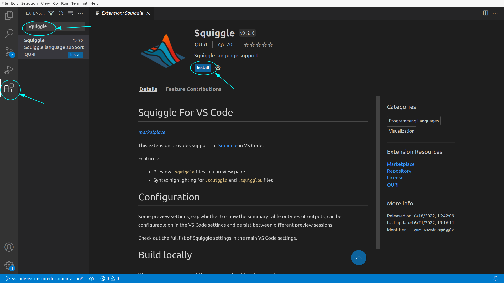
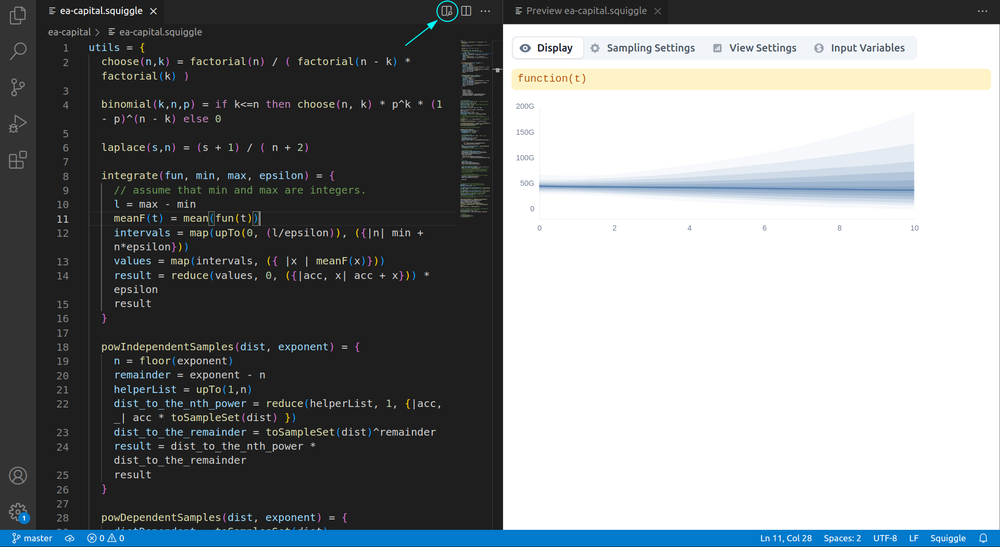
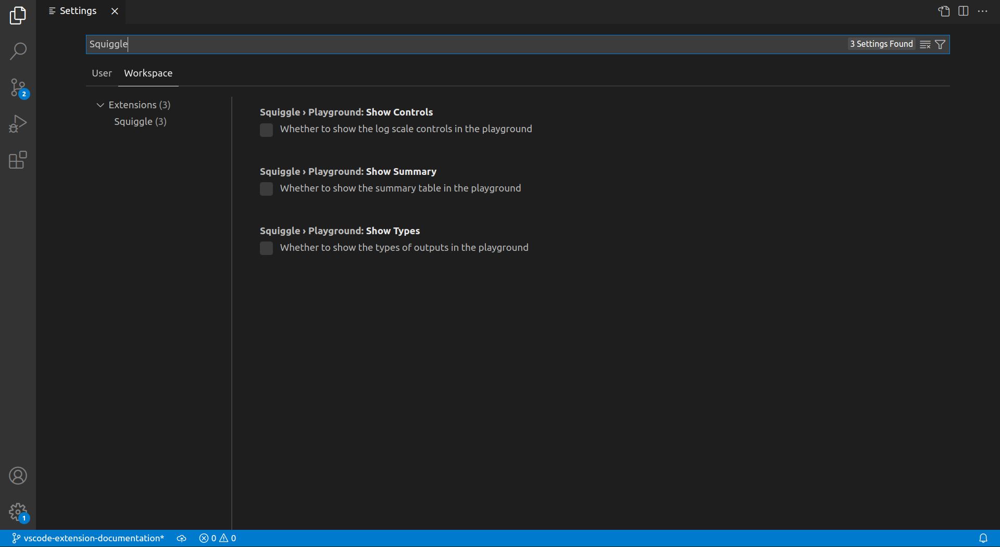

# Squiggle For VS Code

## About

This extension provides support for [Squiggle](https://www.squiggle-language.com/) in VS Code. It can be found in the VS code _[marketplace](https://marketplace.visualstudio.com/items?itemName=QURI.vscode-squiggle)_

Features:

- Preview `.squiggle` files in a preview pane
- Syntax highlighting for `.squiggle` and `.squiggleU` files

## Installation 

You can install this extension by going to the "extensions" tab, searching for "Squiggle", and then installing it.

## Usage

After loading a `.squiggle` file, an "Open Preview" button will appear. If you click it, the squiggle model will be shown, and updated as you edit and save you file.

### Configuration (optional)

Some preview settings, e.g. whether to show the summary table or types of outputs, can be configurable on in the VS Code settings and persist between different preview sessions. The VS Code settings can be accessed with the shortcut `Ctrl+,` with `Ctrl+Shift+P` + searching "Open Settings", or by accessing a file like `$HOME/.config/Code/User/settings.json` in Linux (see [here](https://stackoverflow.com/questions/65908987/how-can-i-open-visual-studio-codes-settings-json-file)) for other operating systems. 

Check out the full list of Squiggle settings in the main VS Code settings.

## Build locally

We assume you ran `yarn` at the monorepo level for all dependencies.

Then, simply `yarn compile` at the `vscode-ext` package level. It will build `squiggle-lang`, `squiggle-components`, and the VS Code extension source code.
